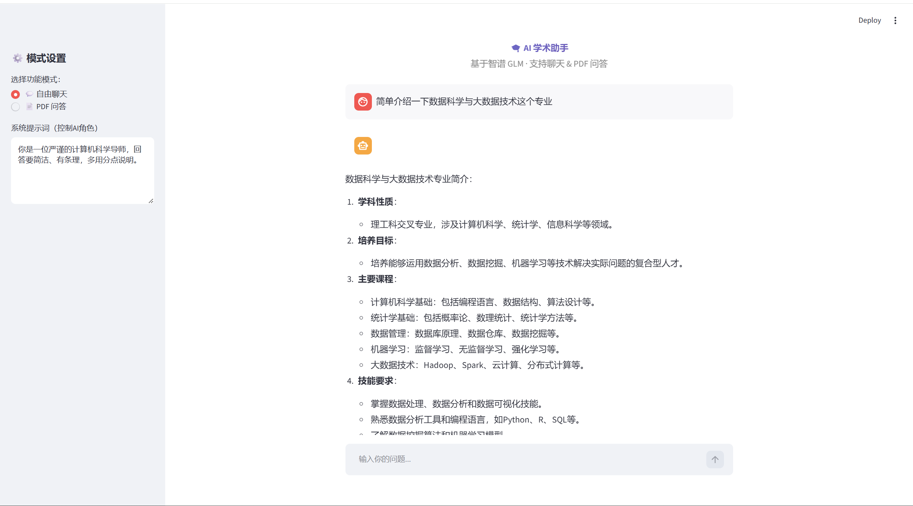

# 🤖 LLM 智能助手（聊天 + PDF 问答）

基于智谱 GLM API 搭建的 AI 智能助手，支持多轮连续对话和基于 PDF 文档的检索增强生成（RAG）问答。

---

## 🎯 项目简介

本项目调用智谱 GLM-4 Flash 和 Embedding API，构建了一个功能完整的 AI 助手应用。包含两个核心功能模块：**自由聊天**（支持多轮对话和角色设定）和 **PDF 文档问答**（上传 PDF 后基于内容回答问题）。

---

## 🚀 核心功能

| 功能模块 | 说明 |
|----------|------|
| 💬 自由聊天 | 多轮连续对话，支持 System Prompt 自定义角色（如"学术导师"） |
| 📄 PDF 问答 | 上传 PDF 文档，AI 基于文档内容回答问题（RAG 检索增强生成） |
| 🎨 网页界面 | 基于 Streamlit 构建，支持聊天记录持久化（刷新不丢失） |
| 🔐 安全配置 | 通过 `.env` 文件管理 API Key，不上传到代码仓库 |

---


## 📸 界面预览

### 自由聊天模式



---

## 📁 项目结构

```
LLM-Chatbot/
├── chat.py              # 终端版多轮对话
├── app.py               # Streamlit 网页版（含聊天 + RAG）
├── rag_demo.py          # RAG 终端版（PDF 问答）
├── requirements.txt     # 项目依赖
├── .env.example         # 环境变量示例文件
└── README.md            # 项目说明
```

---

## 🛠️ 技术栈

- Python 3.10
- Streamlit（网页界面）
- 智谱 GLM API（大模型调用）
- 智谱 Embedding API（文本向量化）
- FAISS（向量检索）
- LangChain（文档加载与切分）
- PyPDF（PDF 解析）

---

## 📦 环境安装

```bash
# 1. 克隆仓库
git clone https://github.com/FF-maker046/LLM-Chatbot-RAG-Demo.git
cd LLM-Chatbot

# 2. 安装依赖
pip install -r requirements.txt -i https://pypi.tuna.tsinghua.edu.cn/simple

# 3. 配置环境变量
cp .env.example .env
# 编辑 .env 文件，填入你的智谱 API Key
```

---

## ▶️ 运行方式

### 终端版聊天

```bash
python chat.py
```

### 网页版（推荐）

```bash
streamlit run app.py
```

浏览器打开 `http://localhost:8501` 即可使用。

### RAG 终端版（PDF 问答）

```bash
python rag_demo.py
```

---

## 📊 功能演示

### 自由聊天模式

- 支持连续对话，AI 能记住上下文
- 可自定义 System Prompt（如"你是一位计算机科学导师"）
- 聊天记录在刷新页面后依然保留

### PDF 问答模式

- 上传 PDF 文档
- AI 自动提取相关内容回答问题
- 基于向量检索，回答有据可依

---

## 📝 环境变量说明

创建 `.env` 文件，内容如下：

```env
ZHIPUAI_API_KEY=你的智谱API密钥
```

> ⚠️ 请勿将 `.env` 文件上传到公开仓库。
